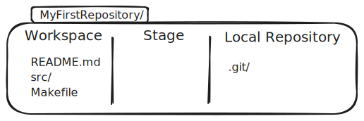

## What is Git?

**Git** is a *decentralized* version control system created in 2005 by Linus Torvalds.
Git tracks changes to files over time and do not prioritize one repository over others.
It allows you to revert to previous versions, collaborate with others, and keep a history of your work.

### Install and configure git

Install git on your OS:
- Doc: https://git-scm.com/book/en/v2/Getting-Started-Installing-Git
- Add git to your `PATH`

```
$ git --version
git version 2.39.2
```

You can configure git on your machine.
Usually, you should at least configure your email and name using these commands:

```
$ git config --global user.email "bob@leponge.fr"
$ git config --global user.name "Bob Leponge"
```

Those custom settings are stored in `~/.gitconfig` on Mac and Linux:

```
$ cat ~/.gitconfig
[user]
email = luc.fabresse@imt-nord-europe.fr
name = Luc Fabresse
```

You could have edited this file directly.

### Create your first local repository

> Doc: https://git-scm.com/book/en/v2/Git-Basics-Getting-a-Git-Repository

```
$ mkdir MyFirstRepository
$ cd MyFirstRepository
$ git init
Initialized empty Git repository in /tmp/MyFirstRepository/.git/
$ ls -a
.git
```

__git init__ initialize a directory as a local git repository so that we can then track versions of files inside this directory.

### Local repository

A local repository contains 3 areas:
- a **Workspace** or **working copy** that contains files on which you are working. Some of them may be tracked by git. Initially empty.
- a **Stage area** or **index**  that stores information about what will go into your next commit (we will come to that later on). Initially empty.
- a **Local repository** (__.git__ folder automatically created and managed by git) that contains the history i.e. all the versions of all tracked files.

> Note: from the user perspective, a git repository is a regular folder that contains at least a .git subfolder.





### Your first commit

Add a `README.md` file into it this **MyFirstRepository** folder that contains:
```
# My super project

A collection of small games.
```

We added a file named README.md and modified it in the workspace.
`git status` reports that README.md as an __untracked file__.
```
$ git status
On branch main

No commits yet

Untracked files:
  (use "git add <file>..." to include in what will be committed)
	README.md

nothing added to commit but untracked files present (use "git add" to track)
```


A file in your worskpace has one these 4 status:
- __untracked__ i.e. this file and its modifications are ignored by git there no history of the content of this file is stored
- __unmodified__ i.e. has been tracked and committed but not modified since
- __modified__ i.e. since a previous commit
- __staged__ ready for next commit

> Doc: https://git-scm.com/book/en/v2/Git-Basics-Recording-Changes-to-the-Repository

First, let's stage README.md:

```
$ git add README.md
$  git status
On branch main

No commits yet

Changes to be committed:
  (use "git rm --cached <file>..." to unstage)
	new file:   README.md

```

git status correctly reports that the file is now in the stage area.
We can add multiple files in the staging area.

Then, you can commit meaning that the content all files in the stage area will be stored in the local repository.
```
$ git commit -m "Starting my games collection project"
[main (root-commit) c6345ba] Starting my games collection project
 1 file changed, 3 insertions(+)
 create mode 100644 README.md

$ git status
On branch main
nothing to commit, working tree clean
```

After the commit, git status reports that the workspace is clean i.e. no modifications since the last commit.

> Exercice: add 2 new commits by adding or modifying the README.md

Important: A **Commit** is a snapshot of the staged files in your workspace at a point in time.

### History

> Documentation: https://git-scm.com/book/en/v2/Git-Basics-Viewing-the-Commit-History

git stores all the history of the files at commit time.

```
$ git log --stat
commit d706e712d2c3be767e05742201322ef24ace2a95 (HEAD -> main)
Author: Luc Fabresse <luc.fabresse@imt-nord-europe.fr>
Date:   Thu Aug 1 14:43:17 2024 +0200

    add Bomberman to the list of candidates

 README.md | 3 ++-
 1 file changed, 2 insertions(+), 1 deletion(-)

commit dc00d4065720fc4c5dbe267bd2ed56689b1a8e11
Author: Luc Fabresse <luc.fabresse@imt-nord-europe.fr>
Date:   Thu Aug 1 14:42:59 2024 +0200

    Candidates section

 README.md | 6 +++++-
 1 file changed, 5 insertions(+), 1 deletion(-)

commit c6345bac5a09028e97db308e07253b01ec93c4a6
Author: Luc Fabresse <luc.fabresse@imt-nord-europe.fr>
Date:   Thu Aug 1 14:39:26 2024 +0200

    Starting my games collection project

 README.md | 3 +++
 1 file changed, 3 insertions(+)

```

A commit has a unique identifier named its hash.
In the above example, the most recent commit hash is: dc00d4065720fc4c5dbe267bd2ed56689b1a8e11.

You can now go back in time and checkout all the files in their state of the first commit into your workspace.
Note: your workspace must be cleaned i.e. no uncommitted modification of a tracked file.

```
$ cat README.md
# My super project

A collection of small games.

## Candidates

- Tetris
- Bomberman

$ git checkout c6345bac5a09028e97db308e07253b01ec93c4a6
Note: switching to 'c6345bac5a09028e97db308e07253b01ec93c4a6'.

You are in 'detached HEAD' state. You can look around, make experimental
changes and commit them, and you can discard any commits you make in this
state without impacting any branches by switching back to a branch.

If you want to create a new branch to retain commits you create, you may
do so (now or later) by using -c with the switch command. Example:

  git switch -c <new-branch-name>

Or undo this operation with:

  git switch -

Turn off this advice by setting config variable advice.detachedHead to false

HEAD is now at c6345ba Starting my games collection project

$ cat README.md
# My super project

A collection of small games.
```

Summary: you can navigate in the history of your workspace by ``checkouting`` any commit in the git history given its hash.

Nevertheless, a warning indicates that you are in 'detached HEAD' mode.
Doing a checkout of the most recent commit hash does not solve this.
You must understand branches.

### Branches

In the previous example, the history was linear because we only had one branch.
But, git supports branches and the history is a tree.

Exercices: Do all exercices in the principal tab of https://learngitbranching.js.org/?locale=fr_FR

- **Branch**: A separate line of development. The default branch is usually called `main` or `master`.
- **Merge**: Combining changes from different branches.

What should know:
- branches
- merge / rebase
- HEAD
- reset / revert

> Exercice: How to solve the 'detached HEAD' issue on your local repository?

```
$ git status
HEAD detached at d706e71
nothing to commit, working tree clean

$ git branch
* (HEAD detached at d706e71)
  main

$ git checkout main
Switched to branch 'main'

$ git status
On branch main
nothing to commit, working tree clean
```

## Bibliography

- https://git-scm.com/book/en/v2