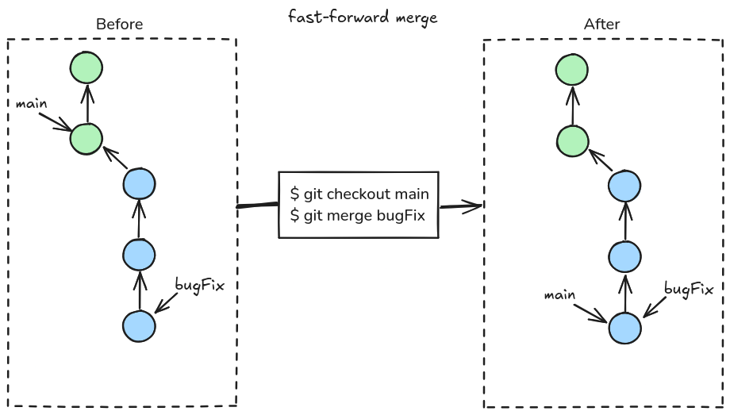
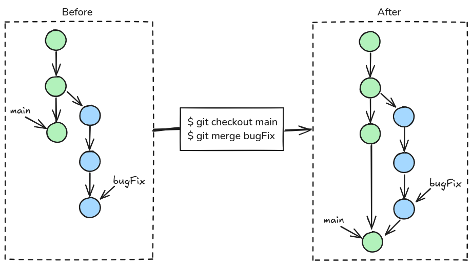
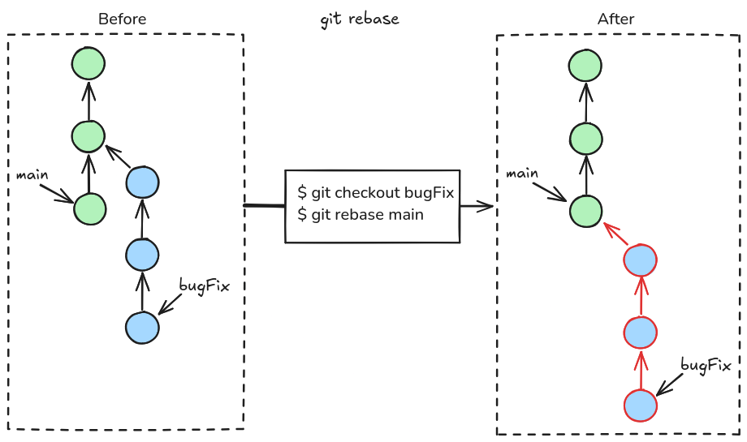

## Merge and Conflicts

When merging 2 branches, we want to merge the history of one branch (its commits) into the another one. It is __mandatory__ that those branches have a common commit ancestor.

## Fast-forward

The simplest case of merging is a fast-forward.
It happens when the latest commit in target branch belongs to the history of the merged branch.



## Merge



Regular merge creates a new commit usually called the merge commit.

## Rebase



You are working on a bugFix but main evolves (1 commit not in the bugFix branch).
You can rebase the bugFix branch on the latest commit in the main branch.
It means that all commits in the bugFix branch will be re-applied.
After the rebase, we could merge bugFix into main and it would always be a fast-forward.

## Conflicts

When doing a merge or a rebase, you may encounter conflicts i.e. git cannot automatically compute the merged history because at least one file has been modified at the same place (line) by commits in different branches.

Example of conflict while merging bugFix into main:
```
$ git checkout main
$ git merge bugFix
Auto-merging merge.txt
CONFLICT (content): Merge conflict in README.md
Automatic merge failed; fix conflicts and then commit the result.
$ git status
# On branch main
# You have unmerged paths.
#   (fix conflicts and run "git commit")
#
# Unmerged paths:
#   (use "git add <file>..." to mark resolution)
#
# both modified:      README.md
#
no changes added to commit (use "git add" and/or "git commit -a")
```

Example of resolution:

```
$ git status
On branch main
You have unmerged paths.
(fix conflicts and run "git commit")
(use "git merge --abort" to abort the merge)

Unmerged paths:
(use "git add <file>..." to mark resolution)

both modified:   README.md

$ cat README.md
# My Project
<<<<<<< HEAD
## Super list of game
=======
## List of games
>>>>>>> bugFix
- Tetris
- Boulder dash
```
Conflicting lines are marked using `<<<<<<<` and `>>>>>>>` with both versions: the one from the current branch and the other one from the incomming merged branch.

To solve a conflict, you must edit the file, remove those markers, keep on of these two versions or completly replace them whith the text you want.
Then, you can process with a regular commit:

```
$ git add README.md
$ git commit -m "resolve conflicts while merging bugFix"
```


Documentation: <https://docs.github.com/en/pull-requests/collaborating-with-pull-requests/addressing-merge-conflicts/resolving-a-merge-conflict-using-the-command-line>


## Take away

- Fast-forward is the simplest merging case
- Prefer rebase over merge on local branches (simpler history)
- Always merge (never rebase) remote (already pushed) branches (see later)

## Going further

- Merging vs rebasing: <https://www.atlassian.com/git/tutorials/merging-vs-rebasing>
